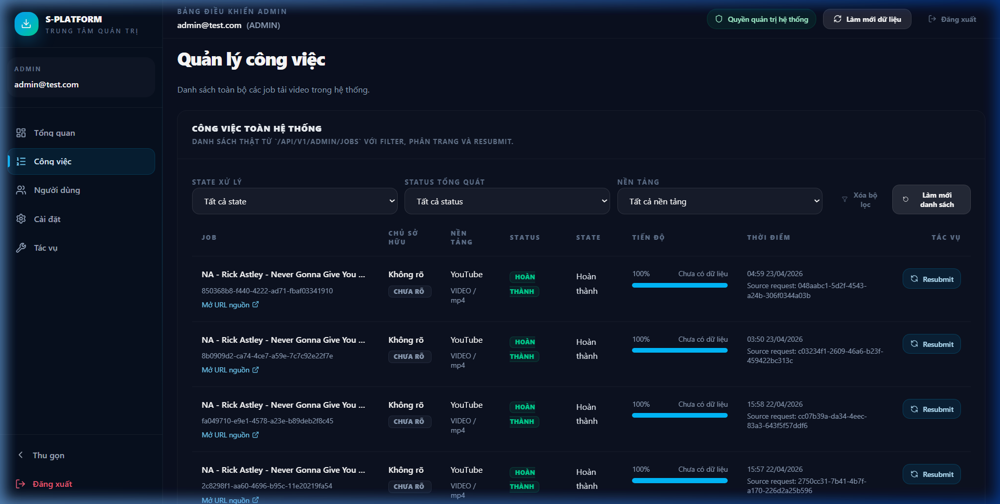
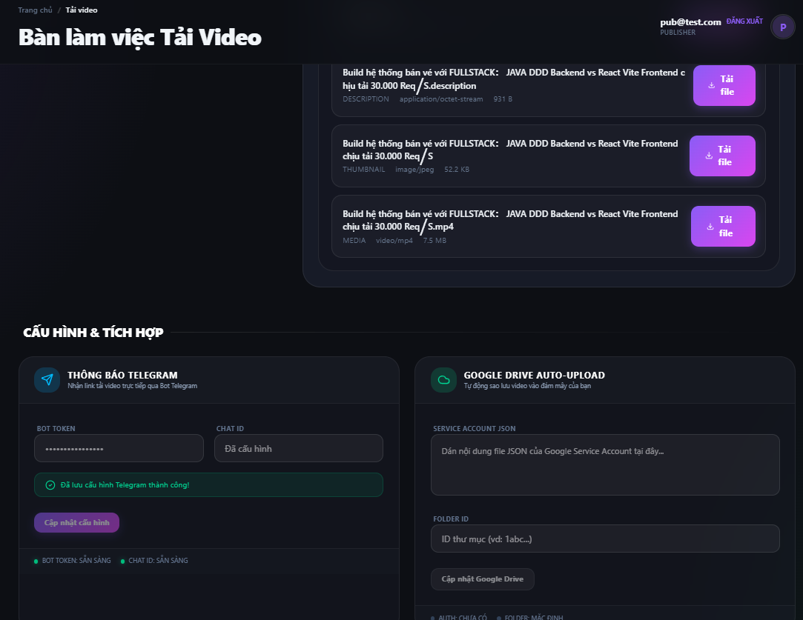
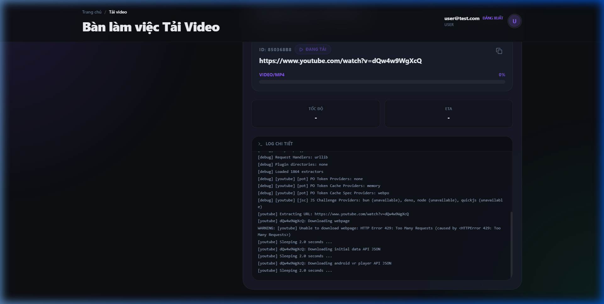
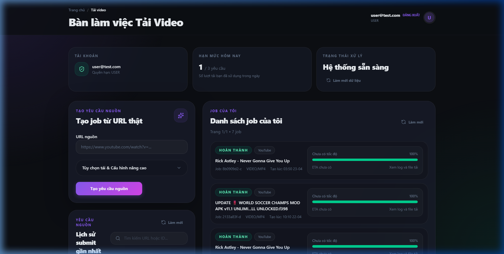
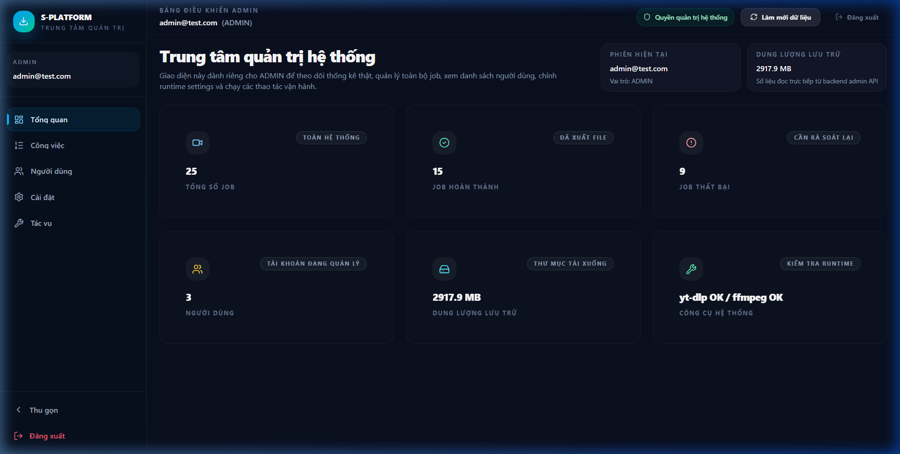
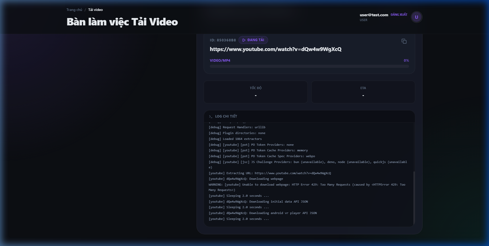
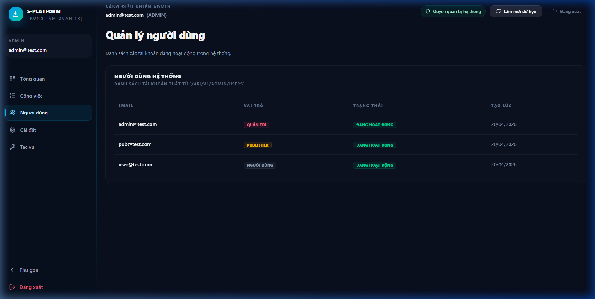
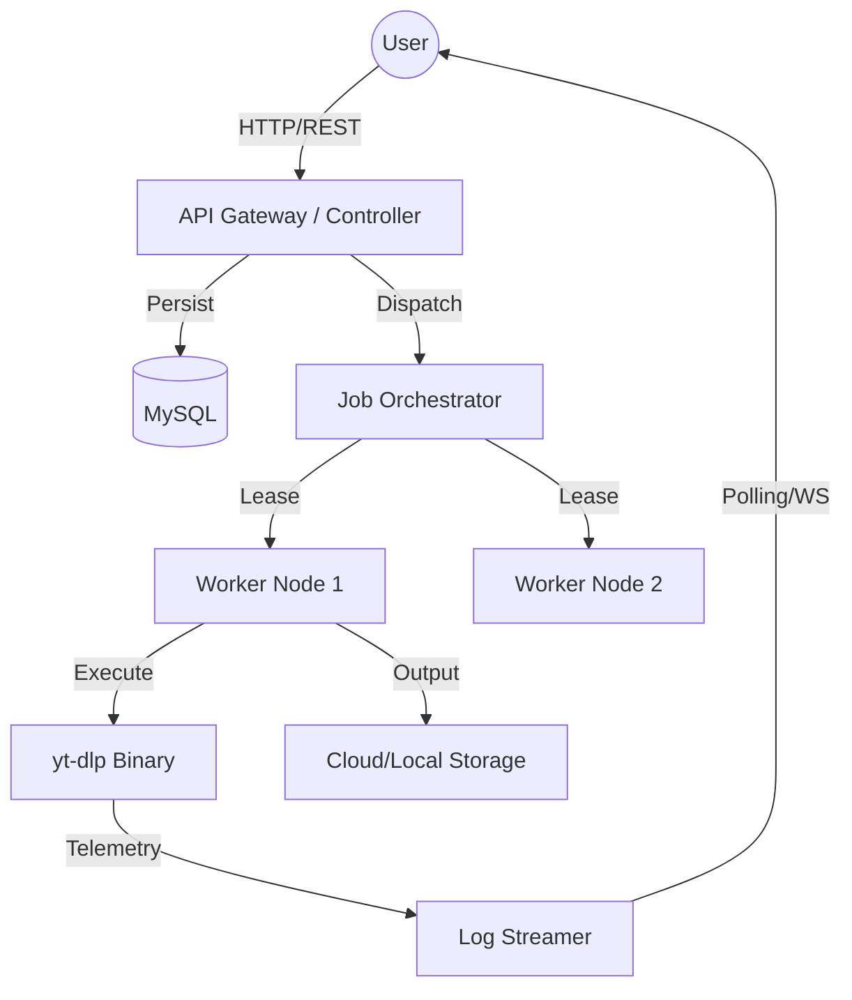

<div align="center">
  <h1>🚀 S-Platform: Scalable Video Processing Engine</h1>
  <p><i>A premium, distributed system for high-throughput media processing and automated workflows</i></p>

  
  
  
  
  
</div>

---

## 🎬 Demo Showcase
Experience the power and aesthetics of **S-Platform** in action. This section demonstrates the seamless transition between customer job submission, real-time monitoring, and administrative oversight.

### 📊 System Monitoring

*Centralized Job Management Interface for Administrators.*

#### 🚀 New Feature: Telegram Automation
S-Platform now supports sending notifications and video files directly to your Telegram as soon as the processing is complete.
- **Smart Bot**: Automatically sends download links and video files (under 50MB).
- **Personal Configuration**: Each user can use their own Bot or the system-wide Bot.
- **Real-time Notifications**: Immediate job status updates.


*New Telegram & Google Drive configuration interface (Publisher Level).*

#### ☁️ Google Drive Integration (Beta)
- **Auto-Upload**: Automatically backup artifacts to your cloud storage.
- **Secure**: Uses Service Account JSON for maximum security.


*Real-time job progress tracking and notification status.*

<div align="center">
  
</div>

### 📸 Visual Experience
Our interface is meticulously crafted with a **Premium Dark Mode** aesthetic, featuring smooth transitions, custom scrollbars, and real-time data visualization.

| **Downloader Workspace** | **Admin Dashboard** |
| :---: | :---: |
|  |  |
| *Real-time progress & log streaming* | *Comprehensive system analytics* |

| **Job Details & Logs** | **User Management** |
| :---: | :---: |
|  |  |
| *Deep dive into processing telemetry* | *Granular Role-Based Access Control* |

---

## 🏗️ System Design & "Hidden Weapons"
S-Platform isn't just a downloader; it's a showcase of modern distributed system patterns.

### 🧩 High-Level Architecture


### 🛡️ Technical Highlights (The "Weapons")

- **Transactional Outbox Pattern**: We use an `outbox_events` mechanism to ensure that job submissions and external notifications (Telegram/Drive) are atomic. If the DB update succeeds, the event is guaranteed to be processed eventually.
- **Distributed Lease Management**: Prevents multiple workers from picking up the same job. Workers "lease" jobs with a heartbeat mechanism to handle node crashes gracefully.
- **Exponential Backoff & Jitter**: Instead of simple retries, we use calculated delays to prevent "thundering herd" issues when external platforms (like YouTube) implement rate limits.
- **Log Telemetry Pipeline**: A sophisticated non-blocking pipeline that captures `stdout` from external binaries and streams it to the frontend via a polling/websocket hybrid approach.
- **Role-Based Access Control (RBAC)**: Comprehensive security layer with specific permissions for `ADMIN`, `MANAGER`, `USER`, and `GUEST`, all protected by CSRF tokens and secure session management.
- **Modular Monolith Design**: The codebase is strictly partitioned into domain modules (`user`, `job`, `downloader`), making it trivial to split into Microservices as the system grows.

---

## ✨ Key Features
- **⚡ High Performance**: Optimized thread management for parallel media processing.
- **🛡️ Industrial Security**: Secure cookie-based authentication and CSRF protection.
- **📊 Real-time Monitoring**: Live speed charts, progress tracking, and log streaming.
- **⚙️ Dynamic Configuration**: Runtime settings for Telegram, Google Drive, and Proxy integration.
- **🔄 Auto-Retry System**: Exponential backoff to handle transient network failures.

## 🛠 Tech Stack
- **Backend**: Java 17, Spring Boot 3.3.0, Spring Security (RBAC)
- **Frontend**: React 19, Tailwind CSS, Lucide Icons, Framer Motion
- **Database**: MySQL 8.0, Flyway Migrations
- **Infrastructure**: Docker & Docker Compose
- **Engine**: yt-dlp (Distributed processing binary)

---

## ⚡ Getting Started

### 1. Prerequisites
- **Docker** & **Docker Compose**
- **Java 17+** (Optional, for local development)

### 2. Launching the System
```bash
# Build and start all services (App, DB, Cache)
docker-compose up -d --build
```
The application will be available at `http://localhost:5173` (Frontend) and `http://localhost:8080` (API).

### 3. Default Credentials
- **Admin**: `admin@test.com` / `admin`
- **Publisher**: `user@test.com` / `user`

---

## ⚠️ Disclaimer
This project is for **educational and research purposes only**. It demonstrates complex system design principles and is not intended for unauthorized media downloading. The author is not responsible for any misuse.

<div align="center">
  <sub>Built with ❤️ by Le Huy Tuong</sub>
</div>
