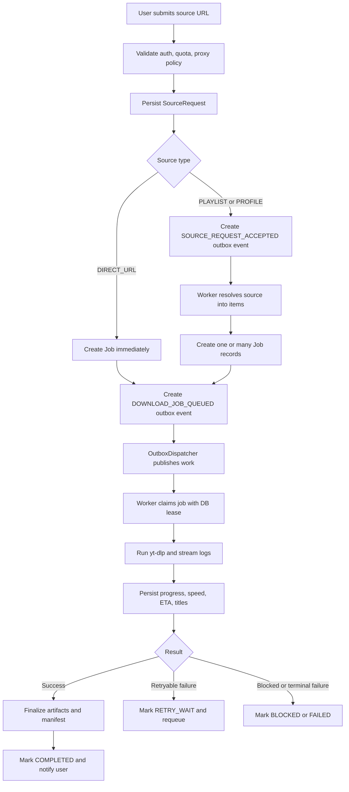

# Business Flow

This document describes the actual business flow implemented in the current codebase for the downloader platform.

## Scope

The current system is a multi-platform media downloader with asynchronous job processing.

Supported platforms:

- `YOUTUBE`
- `TIKTOK`
- `INSTAGRAM`
- `FACEBOOK`

Main user roles:

- `ADMIN`
- `PUBLISHER`
- `USER`

Main business capability:

- Users submit a source URL.
- The system validates the request and stores it as a `SourceRequest`.
- The request is resolved into one or many `Job` records.
- Background workers execute the download through `yt-dlp`.
- Downloaded files are stored under `downloads/jobs/...`.
- Users can poll progress, inspect logs, and download output files.

## Main Components

- `DownloaderApiV1Controller`: entry point for user-facing downloader APIs.
- `DownloadAccessPolicyService`: authentication, quota, ownership, and proxy policy.
- `SourceRequestService`: converts API input into `SourceRequest` and `Job` records.
- `OutboxService`: persists async work as outbox events.
- `OutboxDispatcher`: dispatches outbox rows to local workers or Redis streams.
- `DownloadWorkerService`: resolves source requests and executes download jobs.
- `DownloaderService`: runs `yt-dlp`, parses progress, and materializes cookie files.
- `DownloadArtifactService`: manages job folders, stored files, manifest generation, and cleanup.
- `TelegramNotificationService`: sends completion and failure notifications.

## End-to-End Flow



## Detailed Business Flow

### 1. Authentication and session setup

- The frontend obtains a CSRF token from `GET /api/v1/auth/csrf`.
- The user logs in through `POST /api/v1/auth/login`.
- All later `/api/v1/**` requests reuse the authenticated session cookie.

This is session-based auth, not stateless JWT auth.

### 2. User submits a source request

Entry point:

- `POST /api/v1/source-requests`

The request may contain:

- `sourceUrl`
- `platform`
- `sourceType`
- `downloadType`
- `quality`
- `format`
- `writeThumbnail`
- `cleanMetadata`
- `startTime`
- `endTime`
- `proxyRef`
- `proxy`
- `titleTemplate`
- `watermarkText`

Business rules applied before accepting the request:

- The user must be authenticated.
- Daily quota is enforced by role.
- `USER` cannot use a custom proxy.
- Platform can be auto-detected from the URL.
- Source type can be auto-inferred from the URL.

Current quota model:

- `ADMIN`: effectively unlimited
- `PUBLISHER`: 20 jobs per day
- `USER`: 3 jobs per day

### 3. Source request persistence

After validation, the system persists a `SourceRequest`.

The stored request acts as the durable input snapshot for the worker pipeline. This is important because workers should not depend on web/session state later.

Two main branches exist:

#### Branch A: direct URL

If the source is classified as `DIRECT_URL`:

- The `SourceRequest` is marked `RESOLVED` immediately.
- One `Job` is created immediately.
- A `DOWNLOAD_JOB_QUEUED` outbox event is created.

Typical examples:

- One YouTube watch URL
- One TikTok post URL
- One Instagram reel/post URL
- One Facebook video URL

#### Branch B: playlist or profile

If the source is classified as `PLAYLIST` or `PROFILE`:

- The `SourceRequest` remains an accepted request first.
- A `SOURCE_REQUEST_ACCEPTED` outbox event is created.
- A worker later resolves that URL into concrete items.
- One source request may fan out into many jobs.

Typical examples:

- YouTube playlist
- YouTube channel/profile
- Other supported profile-like feeds

### 4. Async dispatch through outbox

The system decouples HTTP submission from background execution by using an outbox table.

Flow:

- API code writes a business event into the outbox table.
- `OutboxDispatcher` polls pending outbox rows on a schedule.
- If Redis is disabled, it pushes work to a local executor.
- If Redis is enabled, it publishes event ids to a Redis stream for worker consumption.

This gives the project two operating modes:

- Single-node local mode
- Multi-worker mode with Redis stream dispatch

### 5. Resolving playlist/profile into jobs

When a worker processes `SOURCE_REQUEST_ACCEPTED`:

- The `SourceRequest` is moved to `RESOLVING`.
- The matching provider resolves the source URL into one or many `ResolvedItem` records.
- If the provider says the source is blocked, the request becomes `BLOCKED`.
- Otherwise the worker creates one `Job` per resolved item.
- Each created job gets its own `DOWNLOAD_JOB_QUEUED` outbox event.

There is also a duplicate guard:

- If a resolved item already exists for the same user, platform, external item id, and requested variant, the system skips creating a duplicate job.

Requested variant is effectively derived from:

- `downloadType`
- `quality`
- `format`

### 6. Worker claims and runs a download job

When a worker processes `DOWNLOAD_JOB_QUEUED`:

- It first respects global concurrency limits.
- It then respects per-provider concurrency limits.
- It attempts to claim the job through a DB lease.
- Only jobs in `QUEUED` or `RETRY_WAIT` can be claimed for execution.

After a successful claim:

- The job moves to `RUNNING`.
- A `DownloadAttempt` row is created.
- The worker prepares a dedicated job folder.
- Provider cookies are materialized to a local `cookies.txt` file if configured for that user and platform.
- The system builds a provider-specific `yt-dlp` command.
- The worker runs the external process and streams stdout in real time.

### 7. Runtime progress tracking

While `yt-dlp` is running:

- Raw output lines are appended to in-memory job logs.
- Progress lines are parsed into structured fields.
- The job may update:
  - `videoTitle`
  - `playlistTitle`
  - `progressPercent`
  - `downloadSpeed`
  - `eta`
  - `currentItem`
  - `totalItems`
  - `errorMessage`
- Runtime progress is persisted to the database on a throttled interval.

This is why the job detail API can expose near-real-time progress instead of only final status.

### 8. Artifact handling after download

If the download succeeds:

- Partial `.part` or `.ytdl` files are cleaned.
- The system optionally applies watermark text to downloaded thumbnails.
- Output files are scanned and synced into `StoredAsset`.
- Max file size policy is enforced.
- A `manifest.json` file is generated inside the job directory.

Artifacts may include:

- media files such as `mp4`, `mkv`, `webm`, `mp3`, `m4a`
- thumbnails
- subtitles
- descriptions
- generated manifest files

### 9. Completion, retry, and failure behavior

If execution succeeds:

- The current attempt is marked successful.
- The job is marked `COMPLETED`.
- Telegram notification may be sent if user settings are configured.

If execution fails with a retryable category:

- The attempt is saved as failed.
- The job moves to `RETRY_WAIT`.
- `nextAttemptAt` is set with backoff.
- A delayed `DOWNLOAD_JOB_QUEUED` outbox event is created.

Current retryable categories include:

- `RATE_LIMIT`
- `TEMPORARY`
- `TIMEOUT`
- `PROCESS_ERROR`
- `UNKNOWN`

If execution fails with a terminal or blocked category:

- The job becomes `FAILED` or `BLOCKED`.
- Failed artifacts are cleaned up.
- Telegram failure notification may be sent.

Current blocked categories include:

- `INVALID_URL`
- `PRIVATE_CONTENT`
- `REMOVED`
- `PERMISSION_DENIED`
- `UNSUPPORTED`

### 10. Recovery and resilience

The worker includes safety nets for unstable execution:

- DB lease prevents multiple workers from running the same job simultaneously.
- Expired running jobs are moved back to `RETRY_WAIT`.
- Work can be re-queued after worker crashes or timeouts.
- Concurrency is controlled globally and per provider.

This is the core reason the project behaves like a durable async pipeline instead of a simple synchronous downloader.

### 11. User reads results

After submission, the user can:

- list source requests via `GET /api/v1/source-requests`
- list jobs via `GET /api/v1/jobs`
- get one job via `GET /api/v1/jobs/{id}`
- inspect logs via `GET /api/v1/jobs/{id}/logs`
- list artifacts via `GET /api/v1/jobs/{jobId}/files`
- download a specific file via `GET /api/v1/jobs/{jobId}/files/{filename}`

The `JobStatusResponse` DTO is the main API shape used to expose job lifecycle data back to the frontend.

## State Lifecycle

### SourceRequest state flow

Typical lifecycle:

```text
ACCEPTED -> RESOLVING -> RESOLVED
ACCEPTED -> BLOCKED
RESOLVING -> BLOCKED
RESOLVING -> FAILED
```

Special case:

- `DIRECT_URL` requests usually move to `RESOLVED` immediately during submission without waiting for a separate resolve worker step.

### Job state flow

Typical lifecycle:

```text
QUEUED -> RUNNING -> COMPLETED
QUEUED -> RUNNING -> RETRY_WAIT -> RUNNING -> COMPLETED
QUEUED -> RUNNING -> FAILED
QUEUED -> RUNNING -> BLOCKED
```

Note:

- The enum contains `POST_PROCESSING`, but the current worker path usually finalizes artifacts inside the same execution path and then moves directly to `COMPLETED`.

## Representative Scenarios

### Scenario 1: direct YouTube URL

1. User submits one YouTube video URL.
2. Backend validates quota and access policy.
3. Backend persists one `SourceRequest`.
4. Backend creates one `Job`.
5. Backend creates `DOWNLOAD_JOB_QUEUED`.
6. Worker claims the job and runs `yt-dlp`.
7. Progress is exposed through the jobs API.
8. Files are saved and listed for download.

### Scenario 2: playlist URL

1. User submits one playlist URL.
2. Backend persists one `SourceRequest`.
3. Backend creates `SOURCE_REQUEST_ACCEPTED`.
4. Worker resolves playlist items.
5. Worker creates many jobs.
6. Each job is queued and executed independently.
7. User sees one source request mapped to many jobs.

### Scenario 3: temporary provider failure

1. Worker starts a job.
2. Provider returns a temporary or rate-limit error.
3. The job moves to `RETRY_WAIT`.
4. Backoff is applied.
5. The job is re-queued automatically.
6. A later attempt may complete successfully.

## Current Scope vs Prepared Scope

Implemented in the active flow:

- multi-platform URL detection
- async outbox-based execution
- per-user quotas and proxy rules
- provider cookies per user and platform
- download progress tracking
- artifact listing and direct file download
- Telegram completion and failure notifications

Prepared but not fully wired into the current download pipeline:

- Google Drive credentials and folder settings are stored and validated, but there is no active upload-to-Drive step in the current worker flow.

## Suggested Reading Order

- `docs/api-v1-contract.md`
- `src/main/java/com/example/platform/downloader/ui/DownloaderApiV1Controller.java`
- `src/main/java/com/example/platform/downloader/application/SourceRequestService.java`
- `src/main/java/com/example/platform/downloader/application/outbox/OutboxDispatcher.java`
- `src/main/java/com/example/platform/downloader/application/job/DownloadWorkerService.java`
- `src/main/java/com/example/platform/downloader/application/DownloaderService.java`
- `src/main/java/com/example/platform/downloader/application/DownloadArtifactService.java`
